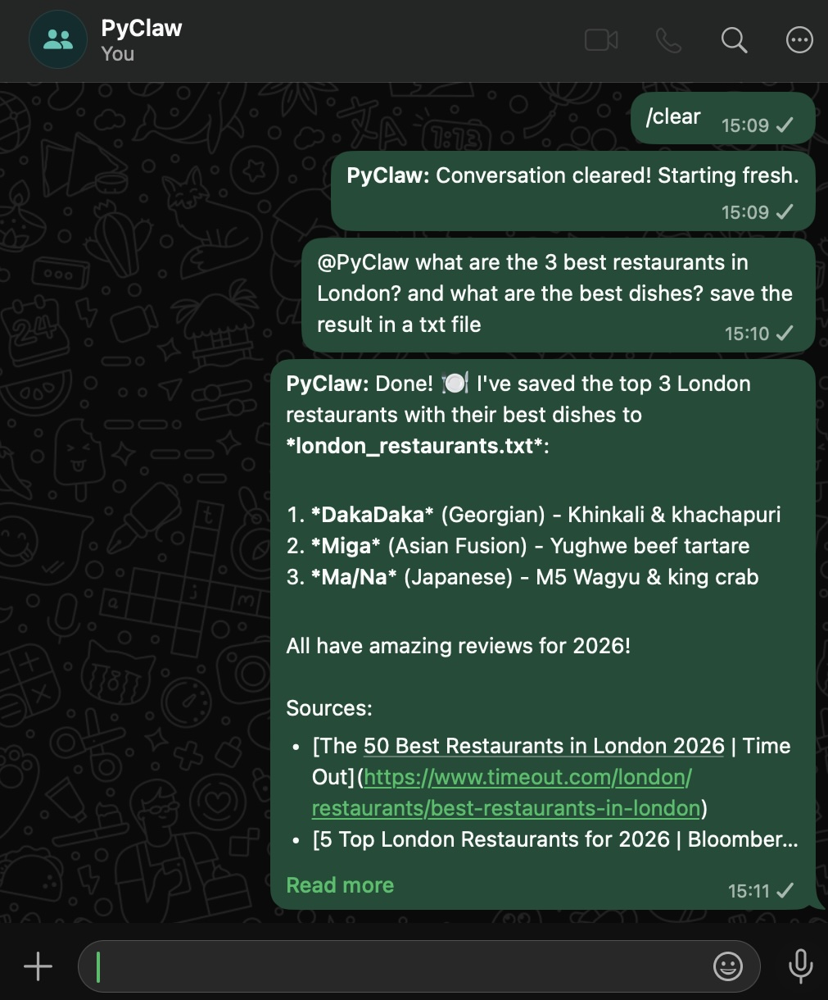

# PyClaw

I was fascinated by [OpenClaw](https://openclaw.ai/) and its potential, but wanted to deeply understand how it worked. So I built this.

PyClaw is a minimal educational implementation of OpenClaw in Python (~500 lines) that uses WhatsApp for interactions. Clean, readable code — simplicity and clarity over features.

<p align="center">
  
</p>

**Design philosophy:** At every decision point, we chose the simplest option that works:
- **Polling** instead of webhooks — no server needed, just a loop
- **SQLite** instead of a database server — zero setup, single file
- **Per-folder isolation** instead of complex permissions — Claude just runs in different directories

---

## Architecture Overview

```
┌─────────────┐      ┌─────────────┐      ┌─────────────┐
│  WhatsApp   │ ───▶ │   SQLite    │ ───▶ │  Poll Loop  │
│  (Neonize)  │      │  (messages) │      │ (every 2s)  │
└─────────────┘      └─────────────┘      └──────┬──────┘
                                                  │
                     ┌────────────────────────────┘
                     ▼
              ┌─────────────┐     ┌─────────────────┐
              │  Registered │ NO  │                 │
              │    chat?    │────▶│     Skip        │
              └──────┬──────┘     └─────────────────┘
                     │ YES
                     ▼
              ┌─────────────┐     ┌─────────────────┐
              │  @PyClaw    │ NO  │                 │
              │  trigger?   │────▶│     Skip        │
              └──────┬──────┘     └─────────────────┘
                     │ YES
                     ▼
              ┌─────────────┐      ┌─────────────┐
              │ Claude SDK  │ ───▶ │  WhatsApp   │
              │ (in folder) │      │  Response   │
              └─────────────┘      └─────────────┘
```

---

## What Does a Personal AI Assistant Need?

Before diving into code, let's think about what we're building:

1. **A way to talk to it** — Some messaging interface you already use. PyClaw uses WhatsApp, but it could be Telegram, Discord, etc.

2. **An AI that can answer** — Claude via the [Agent SDK](https://github.com/anthropics/claude-code-sdk-python). Unlike the regular Claude API where you send a message and get a response, the Agent SDK lets Claude use *tools* autonomously — it can search the web, read/write files, and take multiple steps to complete a task. It also handles conversation memory via `session_id`.

3. **Different contexts for different conversations** — Your "work" chat shouldn't know about your "personal" chat. Each needs its own memory.

4. **Always listening** — Unlike Claude Code where you manually start a conversation, a personal assistant should be "always on" — ready to respond whenever a message arrives. But how do you make something that's always waiting?

5. **A trigger mechanism** — The AI shouldn't respond to EVERY message, just the ones directed at it (e.g., starting with `@PyClaw`).

---

## How PyClaw Implements This

### Step 1: Messages Arrive via WhatsApp

PyClaw connects to your WhatsApp account — exactly like WhatsApp Web. You scan a QR code to link it.

Once connected, it sees all messages you receive. Messages from **registered chats** are stored in a SQLite database (our "inbox"). Messages from other chats are ignored.

```
Your Phone (WhatsApp) ←→ PyClaw ←→ SQLite Database (registered chats only)
```

### Step 2: A Loop Continuously Checks for New Messages

This is the "always on" part. A `while True` loop runs forever:

```python
while True:
    messages = db.get_new_messages(since=last_timestamp)
    for msg in messages:
        process(msg)
        last_timestamp = msg.timestamp
    time.sleep(2)  # Check every 2 seconds
```

Every 2 seconds it asks: *"What messages arrived since I last checked?"*

The `last_timestamp` is key — it tracks our position in the inbox. We only process messages newer than this timestamp, then advance it. If the bot crashes, it picks up where it left off.

### Step 3: Filter — Is This a Chat We Care About?

Not every WhatsApp chat should trigger the bot. You define which chats to monitor in `registered_groups.json`:

```json
{
  "12345@s.whatsapp.net": {
    "name": "Main",
    "folder": "main"
  }
}
```

Each entry maps a WhatsApp chat ID to:
- A human-readable **name**
- A **folder** where Claude will work (for isolation)

If a message comes from an unregistered chat → skip it.

### Step 4: Trigger — Is This Message for the Assistant?

Even in registered chats, we don't respond to every message. Only messages starting with `@PyClaw` (the trigger pattern).

```
"@PyClaw what's the weather?" → ✓ Process this
"Hey everyone, meeting at 5pm" → ✗ Skip this
```

This lets you have normal conversations in a group without the bot interrupting.

### Step 5: Send to Claude

Now we have a message that's:
- From a registered chat ✓
- Starts with the trigger ✓

Time to call Claude:

1. Strip the trigger: `"@PyClaw what's the weather?"` → `"what's the weather?"`
2. Build a prompt with context (sender name, group name)
3. Call the Claude Agent SDK
4. Claude runs **in the chat's folder** — this is the isolation!

### Step 6: Response and Continuity

After Claude responds:

1. **Send the response** back to WhatsApp (prefixed with "PyClaw:")
2. **Save the `session_id`** — The SDK returns a session ID with each response. Pass it back on the next request and Claude continues the conversation with full context. We store these per-chat in `sessions.json`.
3. **Advance `last_timestamp`** — so we don't re-process this message
4. **Loop continues** — back to Step 2, waiting for the next message

---

## Per-Chat Isolation

Each registered chat gets its own isolated context.

### Adding a New Chat

To add a new WhatsApp chat (group or individual):

1. **Get the chat's JID** — Send any message in the chat you want to register. PyClaw won't respond (it's not registered yet), but the console will show:
   ```
   [Unregistered] 120363403960689394@g.us — Paolo: hello
   ```
   Copy that JID. Groups end with `@g.us`, individuals end with `@s.whatsapp.net`.

2. **Register it** — Add an entry to `data/registered_groups.json`:
   ```json
   {
     "12345@g.us": {
       "name": "Work",
       "folder": "work"
     }
   }
   ```

3. **Customize the personality** — The folder and a default `CLAUDE.md` are created automatically on first message. Customize it by sending:
   ```
   /personality You help with coding and debugging. Be technical and precise.
   ```
   Or edit `groups/work/CLAUDE.md` directly.

### Example: Multiple Chats

```
data/registered_groups.json:
{
  "111@s.whatsapp.net": {"name": "Main", "folder": "main"},
  "222@g.us": {"name": "News", "folder": "news"},
  "333@g.us": {"name": "Work", "folder": "work"}
}

groups/
├── main/
│   └── CLAUDE.md      ← "You are PyClaw, a helpful assistant"
├── news/
│   └── CLAUDE.md      ← "You summarize tech news concisely"
└── work/
    └── CLAUDE.md      ← "You help with coding and debugging"
```

Each chat has:
- Its own **folder** — Claude can read/write files here without affecting other chats
- Its own **CLAUDE.md** — Instructions, personality, and a "Saved Files" index for this context
- Its own **session_id** — Conversation memory that persists across messages

### The CLAUDE.md File

This is Claude's "briefing document" for each chat. When Claude runs, it reads this file to understand:
- **Who it is** — Name, personality, tone
- **What it can do** — Available tools and capabilities
- **What it remembers** — Persistent notes in the "Memories" section
- **What files exist** — Tracked in the "Saved Files" section

Example structure:
```markdown
# PyClaw

You are PyClaw, a helpful assistant. Be concise.

## What You Can Do
- Save notes and lists to files
- Search the web for current information

## Memories
- User prefers bullet points
- Timezone: London

## Saved Files
- restaurants.txt — Favorite London restaurants
- todos.txt — Weekly task list
```

When Claude creates a file, it updates the "Saved Files" section so it remembers what exists
- Its own **session_id** — Conversation memory that persists across messages

When you ask Claude to save something (e.g., "save my restaurant list"), it creates a file in the chat's folder and tracks it in CLAUDE.md's "Saved Files" section.

The "News" Claude has no idea what you discussed with the "Work" Claude.

---

## Project Structure

```
pyclaw/
├── main.py              # Entry point: poll loop, message processing
├── config.py            # Settings: trigger pattern, paths, intervals
├── agent.py             # Claude Agent SDK wrapper
├── database.py          # SQLite: store and query messages
├── whatsapp.py          # WhatsApp connection via Neonize
├── data/
│   ├── registered_groups.json  # Which chats to monitor
│   ├── sessions.json           # Session IDs per chat
│   └── router_state.json       # last_timestamp
├── store/
│   ├── messages.db             # Message history
│   └── auth/                   # WhatsApp credentials
└── groups/
    └── main/
        └── CLAUDE.md           # Agent instructions
```

---

## Setup

### Requirements
- Python 3.10+
- Anthropic API access (via [API key](https://console.anthropic.com/) or [Claude Max](https://claude.ai/subscribe) subscription)

The `claude-agent-sdk` package (installed via requirements.txt) bundles its own Claude CLI.

### 1. Create Python environment

```bash
conda create -n pyclaw python=3.10
conda activate pyclaw
```

### 2. Install dependencies

```bash
pip install -r requirements.txt
```

### 3. Authenticate Claude

Run `claude` once to authenticate (the SDK bundles the CLI):

```bash
claude
```

Follow the prompts to log in with your Anthropic account.

### 4. Set up your first chat

**a) Find your chat's JID:**

Run `python main.py` and send a test message. The console will show the JID (e.g., `12345@s.whatsapp.net` for individual chats or `12345@g.us` for groups).

**b) Register the chat in `data/registered_groups.json`:**
```json
{
  "your-jid@s.whatsapp.net": {
    "name": "Main",
    "folder": "main"
  }
}
```

**c) Send a message** — The folder (`groups/main/`) and a default `CLAUDE.md` are created automatically.

**d) Customize (optional)** — Give Claude a personality by sending:
```
/personality You are PyClaw, a helpful assistant. Be concise.
```
Or edit `groups/main/CLAUDE.md` directly.

See [Per-Chat Isolation](#per-chat-isolation) for adding more chats with different personalities.

### 5. Run

```bash
python main.py
```

First run: scan the QR code with WhatsApp → Settings → Linked Devices → Link a Device.

---

## Usage

Send a message starting with `@PyClaw` in any registered chat:

```
@PyClaw what's the weather like today?
```

### Commands

| Command | Description |
|---------|-------------|
| `/clear` | Reset the conversation (Claude forgets previous messages) |
| `/personality <instructions>` | Update the assistant's personality (preserves Memories and Saved Files) |

Example:
```
/personality You are a tech news summarizer. Use bullet points. Be concise.
```

---

## Configuration

All settings are in `config.py`:

| Setting | Default | Description |
|---------|---------|-------------|
| `ASSISTANT_NAME` | `"PyClaw"` | Name and trigger (uses `@PyClaw`) |
| `POLL_INTERVAL` | `2` | Seconds between message checks |
| `CLAUDE_MODEL` | `"haiku"` | Claude model (`haiku`, `sonnet`, `opus`) |
| `ALLOWED_TOOLS` | `[Read, Write, ...]` | Tools Claude can use |

You can also set `ASSISTANT_NAME` via environment variable:
```bash
ASSISTANT_NAME=MyBot python main.py
```

---

## Security

This is an educational proof-of-concept, not production-ready software.

- **Tool restrictions** — Claude's tools are limited (no Bash/shell access). Only: Read, Write, Edit, Glob, Grep, WebSearch, WebFetch.
- **No sandboxing** — Everything runs locally on your machine without isolation.
- **WhatsApp access** — Connecting grants access to all your chats. We only process registered ones, but the connection sees everything.

Use at your own risk.

---

## License

MIT
